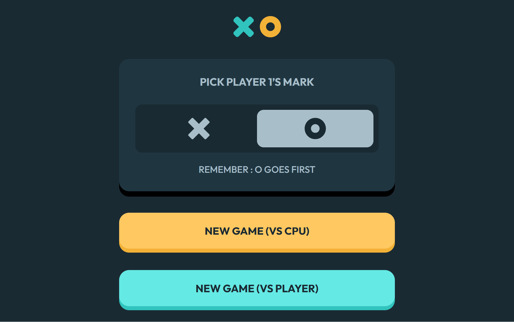

# 🧮 Tic Tac Toe Game
Esta es una solución al [desafío Tic Tac Toe Game en Frontend Mentor](https://www.frontendmentor.io/challenges/tic-tac-toe-game-Re7ZF_E2v). Los desafíos de Frontend Mentor ayudan a mejorar tus habilidades de programación creando proyectos realistas.

## 🔎 Descripción general
Diseño responsive para resolución mobile(375px), tablet(768px) y desktop(1440px)

### 📷 Captura de pantalla

### 🔗 Links
- [Repositorio Git](https://github.com/braismarquez2025/tic-tac-toe-game)
- [URL del sitio en vivo]()

## 🚀 Mi proceso

### 🔧 Llevado a cabo con
- React + Vite
- Sass

### 💡 Lo que aprendí
He practicado un montón la lógica de React con este proyecto ya que he tenido que utilizar hooks que desconocía. El que más me ha servido es useState, pero he incorporado también useEffect o useCallback. Lo que más tiempo me ha llevado ha sido establecer los iconos de la x y la o una vez formado el tres en raya, además del hover, es la parte que más me ha liado sin duda. La conclusión que saco es que siempre es mejor crear un componente al cual pasarle unos parámetros.  

### 📈 Desarrollo continuo
Me voy a especializar con React hasta conseguir un codigo lo mejor estructurado posible, evitando codigo que no sea reutilizable o repetido. Además voy a realizar los siguientes proyectos con TypeScript.

### ✌️ Autor 
- 💼 GitHub - https://github.com/braismarquez2025
- ✉️ Gmail - braismarquez2003@gmail.com
- 👤 Usuario de Frontend - [@braismarquez2025](https://www.frontendmentor.io/profile/braismarquez2025)
- 🔗 LinkedIn - [Brais Márquez](https://www.linkedin.com/in/brais-m%C3%A1rquez-b133b7365/)